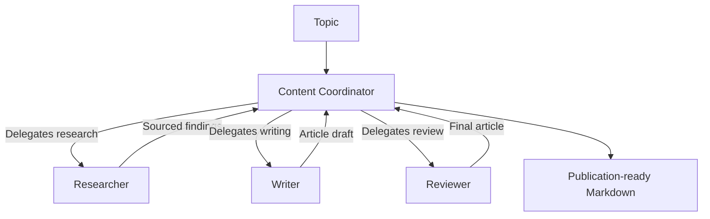

# CrewAI + Gemini Agent Swarm

> A hierarchical multi-agent writing workflow powered by CrewAI, Gemini, and live Olostep web research.

[](https://www.python.org/)
[](https://docs.crewai.com/)
[](https://ai.google.dev/)
[](https://www.olostep.com/)
[](./LICENSE)

This project demonstrates how to build a practical hierarchical agent swarm in a Jupyter notebook. A manager coordinates three specialist agents that research a topic, write an educational article, and polish it for publication.

## How It Works



| Agent | Responsibility |
| --- | --- |
| **Content Coordinator** | Manages the hierarchical workflow, delegates tasks, and validates results. |
| **Researcher** | Searches the live web and gathers sourced evidence within a strict call budget. |
| **Writer** | Turns research into one structured educational article. |
| **Reviewer** | Checks accuracy, clarity, organization, links, and final formatting. |

The crew uses `Process.hierarchical`. The manager is configured separately and is not included in the worker list.

## Workflow

The manager delegates three tasks:

1. **Research:** Collect sourced findings and likely reader questions.
2. **Write:** Produce one complete Markdown article.
3. **Review:** Return the corrected article as the final result.

There is no separate formatting task, article wrapper, or Key Takeaways output.

## Article Format

The final article is approximately 1,000-1,500 words and contains:

1. One descriptive H1 title
2. An unlabeled italic summary directly below the title
3. A `TL;DR` section with 3-5 bullets
4. A concise introduction
5. Clear H2/H3 body sections
6. A table only when it genuinely improves a comparison or decision
7. A conclusion
8. An FAQ section with 3-5 questions immediately after the conclusion

The structure is inspired by clear educational technology publications such as DataCamp, while keeping the writing and organization original.

## Controlled Web Research

The Researcher uses a custom `olostep_web_search` CrewAI tool and decides whether each call needs page scraping:

| Option | Result |
| --- | --- |
| `scrape=False` | Returns titles, URLs, and descriptions for quick discovery. |
| `scrape=True` | Also returns page Markdown for detailed verification. |

To prevent runaway research, the tool enforces:

- Maximum **3** discovery calls with `scrape=False`
- Maximum **6** external search calls overall
- Maximum **3** results per call
- Maximum **4,000 characters** of scraped content per page

After three discovery calls, the agent must use targeted scraping or finish with the evidence already collected.

## Execution Trace

The notebook finishes with a detailed swarm trace showing:

- manager and worker roles;
- hierarchical coordination flow;
- total web calls and remaining budget;
- calls with and without scraping;
- queries, status, result counts, and domain filters;
- task owners and participating agents;
- delegation and tool-use counts;
- tool errors and task duration;
- output previews and per-agent participation.

## Project Files

| File | Description |
| --- | --- |
| `Build_Agent_Swarm_with_CrewAI_and_Gemini_Flash.ipynb` | Main tutorial and executable workflow. |
| `requirements.txt` | Pinned Python dependencies. |
| `.env.example` | API-key variable reference. |
| `.gitignore` | Excludes local secrets, environments, and generated files. |
| `LICENSE` | MIT license. |

## Requirements

- Python 3.11 or newer
- [Google AI Studio API key](https://aistudio.google.com/app/apikey)
- [Olostep API key](https://www.olostep.com/dashboard/)
- Deepnote, Jupyter, or VS Code with the Jupyter extension

## Quick Start

### 1. Clone the repository

```bash
git clone https://github.com/kingabzpro/gemini-crewai-swarm.git
cd gemini-crewai-swarm
```

### 2. Create an environment

```bash
python -m venv .venv
```

Windows PowerShell:

```powershell
.\.venv\Scripts\Activate.ps1
```

macOS or Linux:

```bash
source .venv/bin/activate
```

### 3. Install dependencies

```bash
python -m pip install -U -r requirements.txt
```

### 4. Configure API keys

The notebook reads keys from its process environment.

PowerShell:

```powershell
$env:GEMINI_API_KEY="your-gemini-key"
$env:OLOSTEP_API_KEY="your-olostep-key"
```

macOS or Linux:

```bash
export GEMINI_API_KEY="your-gemini-key"
export OLOSTEP_API_KEY="your-olostep-key"
```

`GOOGLE_API_KEY` can be used instead of `GEMINI_API_KEY`.

For Deepnote, add `GEMINI_API_KEY` and `OLOSTEP_API_KEY` through the project environment-variable or integration settings before running the notebook.

### 5. Run the notebook

Open `Build_Agent_Swarm_with_CrewAI_and_Gemini_Flash.ipynb` and run its cells from top to bottom.

## Core Configuration

```python
crew = Crew(
    agents=[researcher, writer, reviewer],
    tasks=[research_task, write_task, review_task],
    manager_agent=manager,
    process=Process.hierarchical,
    verbose=True,
)
```

The shared Gemini model is configured as:

```python
GEMINI_MODEL = "gemini/gemini-3.5-flash"
```

If that model is unavailable to your API key, replace it with a supported Gemini model.

## Troubleshooting

| Problem | Resolution |
| --- | --- |
| Gemini API key is missing | Set `GEMINI_API_KEY` or `GOOGLE_API_KEY`, then restart the kernel. |
| Olostep API key is missing | Set `OLOSTEP_API_KEY`, then restart the kernel. |
| Gemini returns `404` | Change `GEMINI_MODEL` to a model available to your account. |
| `olostep` cannot be imported | Run `python -m pip install -U olostep`. |
| Notebook event-loop error | Install `nest-asyncio` and run the included `nest_asyncio.apply()` cell. |
| Imports use the wrong environment | Select the project virtual environment as the notebook kernel. |
